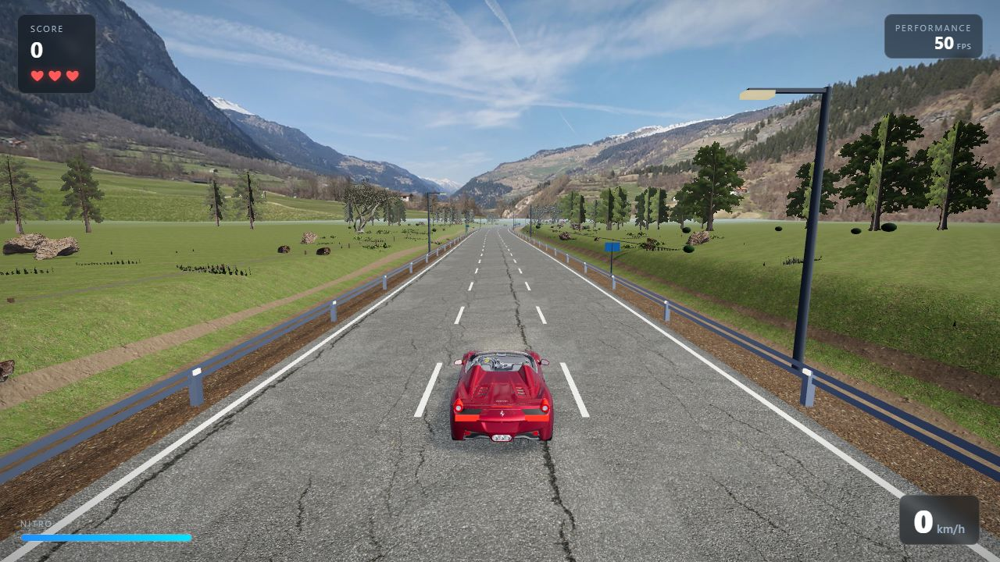

# Turbo Highway 3D

A fast, browser-based 3D highway driving game built with Three.js. Compete in a four-car alpine sprint or dodge traffic in endless mode, use nitro, and chase a high score in a detailed PBR environment.



## Highlights

- Curved, gently elevated endless highway with road-aligned traffic and chase camera
- Four-car 6 km Alpine Pass sprint with six sectors, live position, sampled-road minimap, finish gantry, and best-time records
- Rookie, Sport, and Pro rival AI with tactical overtakes, defending, nitro bursts, and believable mistakes
- Uneven 3D terrain with gravel shoulders, drainage ditches, guardrails, fences, reflectors, signs, and utility poles
- Three distinct tree species plus rocks, ferns, bushes, grass, and wildflowers
- PBR asphalt and terrain materials, HDR environment lighting, alpine panorama, shadows, fog, bloom, and cinematic color grading
- Dynamic eight-minute day cycle with matched morning, daytime, sunset, twilight, and starry-night lighting plus manual overrides
- Detailed player car with working brake lights, rotating tires, nitro effects, and contact shadow
- Traffic, near-miss scoring, three-life collision system, speedometer, nitro bar, and FPS counter
- Reactive three-band engine audio, road/wind noise, nitro, impacts, and UI sounds
- Instanced small vegetation and distance-aware scenery for better browser performance

## Run locally

Requirements: Node.js 20.19 or newer (or Node.js 22.12+).

```bash
npm install
npm run dev
```

Open the local URL printed by Vite. For a production build:

```bash
npm run build
npm run preview
```

## Controls

| Action | Keyboard |
| --- | --- |
| Accelerate | `W` or `Up Arrow` |
| Brake | `S` or `Down Arrow` |
| Steer | `A` / `D` or `Left` / `Right Arrow` |
| Nitro | `Shift` |
| Pause / resume | `P` or `Escape` |
| Mute / unmute | `M` |
| Restart after game over | `R` |

On Android and other touch devices, use the on-screen steering, brake, gas,
nitro, and pause controls. Tilt steering can be enabled from the top control.

## Project structure

```text
src/
  main.js         Game loop, scoring, collisions, and chase camera
  path.js         Shared curved/elevated road centerline
  road.js         Road mesh, lane markings, rails, signs, and roadside fixtures
  environment.js  Terrain, vegetation, models, recycling, and instancing
  car.js          Player vehicle movement and visual effects
  traffic.js      AI traffic placement, recycling, and collision checks
  effects.js      Nitro and crash effects
  scene.js        Renderer, lighting, fog, environment map, and post-processing
  hud.js          Score, lives, speed, nitro, and FPS interface
public/assets/     Runtime models, textures, panorama, and Draco decoder
```

## Android

The project includes a Capacitor Android wrapper with landscape orientation,
immersive fullscreen, touch/tilt controls, and an adaptive mobile graphics
profile. Requirements are Android Studio, Android SDK 36, and Java 21.

Build and sync the web game into Android:

```bash
npm run android:sync
```

Run it on a connected phone or emulator:

```bash
npm run android:run
```

Create a locally signed debug APK on Windows:

```bash
npm run android:apk
```

The APK is written to
`android/app/build/outputs/apk/debug/app-debug.apk`. Use `npm run android:open`
to open the native project in Android Studio for release signing and Play Store
bundle generation.

## Performance notes

The world recycles deterministic 120-metre terrain slices on exact grid boundaries to prevent roadside texture swimming or geometry pops. Small vegetation is rendered with GPU instancing, while distant scenery uses cheaper representations to keep draw calls under control.

## Assets and credits

The project uses CC0 environment assets from [Poly Haven](https://polyhaven.com/) and project-specific generated tree cutouts. Full attribution and source details are in:

- [`public/assets/realistic/SOURCES.md`](public/assets/realistic/SOURCES.md)
- [`public/assets/terrain/SOURCES.md`](public/assets/terrain/SOURCES.md)
- [`public/assets/audio/SOURCES.md`](public/assets/audio/SOURCES.md)

The Ferrari model and any separately supplied vehicle assets remain subject to their original licenses; verify their redistribution terms before commercial use.

## License

The source code is released under the [MIT License](LICENSE). Third-party assets retain their respective licenses as described above.
